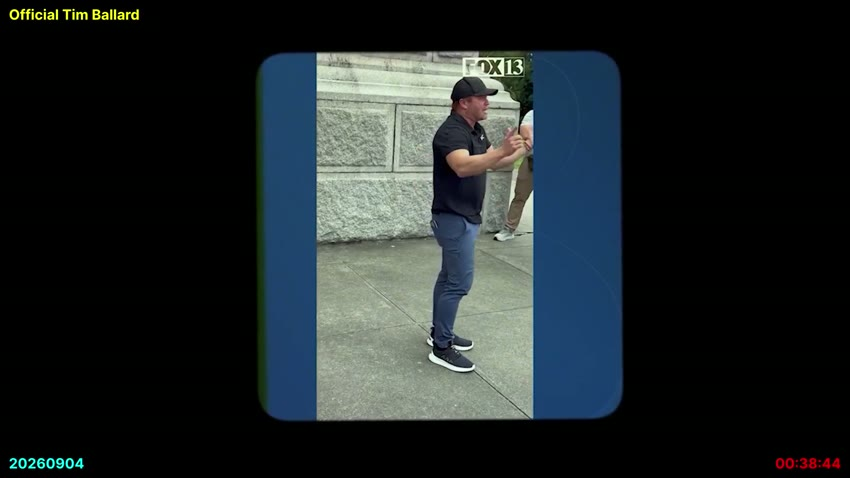
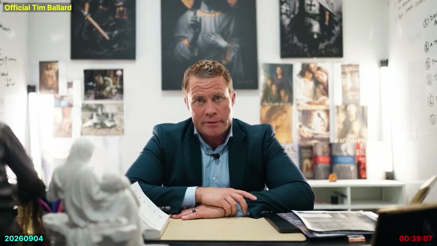
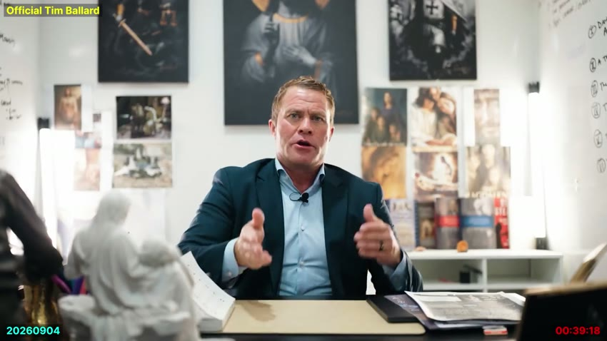
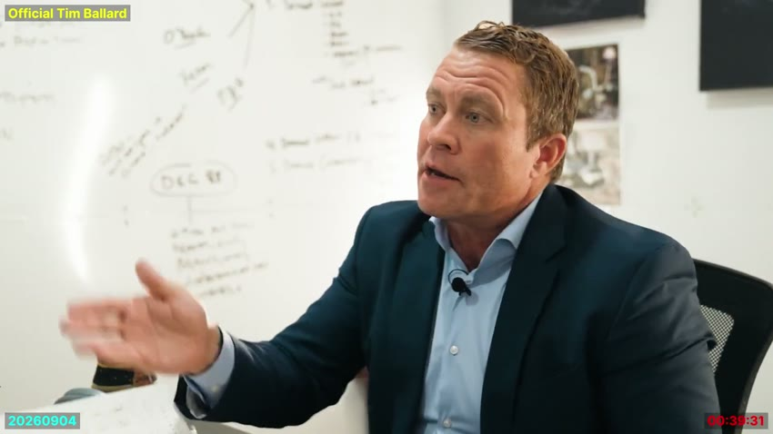
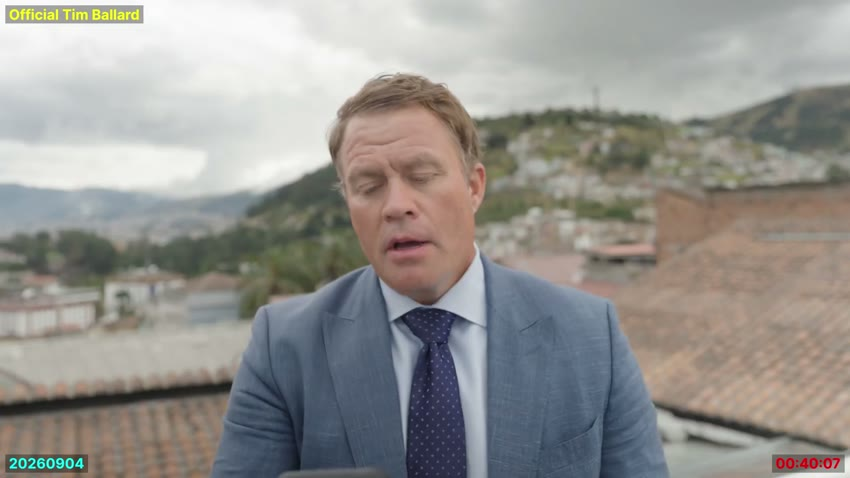
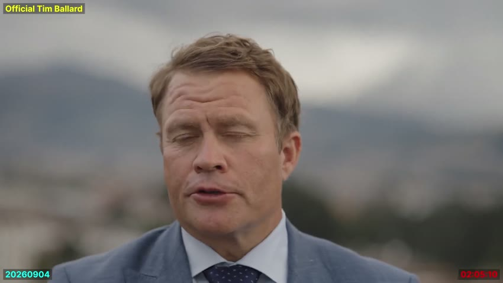
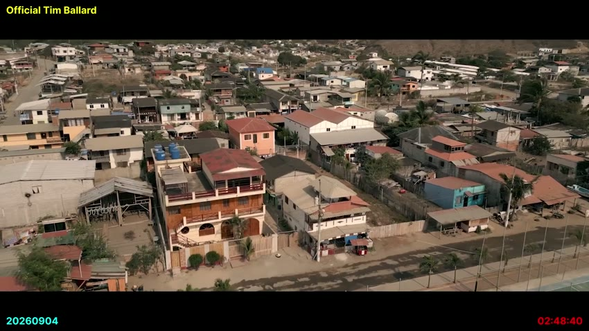
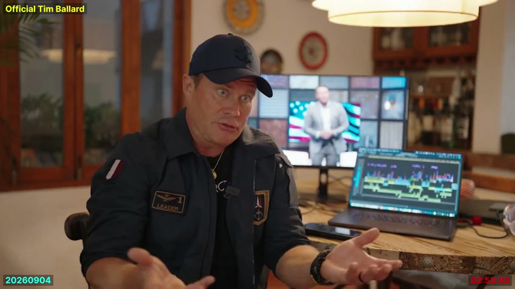
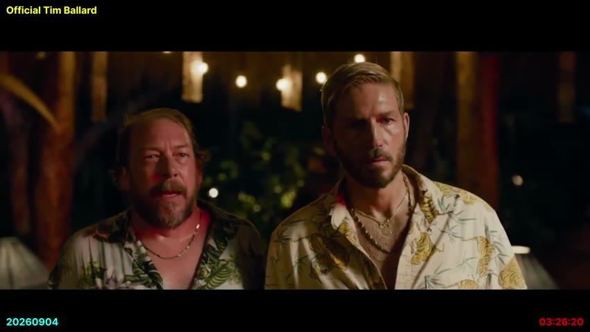
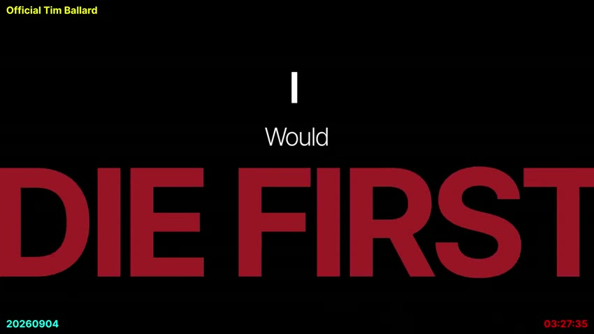

# The "Deseret" cluster — Deseret News, Deseret Enterprises, Sheri Dew, Deseret Book

Full-context pull of all 17 "Deseret" hits in the master SRT
(`youtube__pBo_2DYxfrY_master_stitched_patched.srt`), following up on the
non-dictionary-word audit that already confirmed the transcription of the
word "Deseret" itself is accurate (`backfire_non_dictionary_words_2026-09-11.md`).
These 17 hits turn out to be four distinct threads worth separating.

## Thread 1 — Deseret News (the newspaper), accused of running a coordinated false story

The bulk of the mentions. Ballard's account, in order:

- **[00:38:44–00:39:17]** Claims a story was sent "to their own media arm
  to Deseret News, to KSL, who dutifully reported under the order of the
  lukewarm" — then: "That's why I'm suing Deseret Enterprises because
  when they read that statement, [they] knew it was a lie." (See Thread 2
  below on "Deseret Enterprises" specifically.)
  
  
- **[00:39:18–00:40:17]** Says the relevant projects "were with them...
  under Sherry Dew... under Deseret News," that they "reported on it over
  and over," that "those were the references they deleted on September
  15th, over 70 of them — criminal evidence of tampering possibly," and
  quotes a Deseret News line: "Deseret News independently verified the
  legitimacy of the statement issued by the Church of Jesus Christ of
  Latter-day Saints."
  
  
  
- **[02:04:55–02:05:22]** "When I made reference to how Deseret News
  paraded the Doug Anderson lie and then doubled down with their own
  lie..." — ties directly to the existing, unresolved "Doug Anderson" /
  "Dick Andersen" naming question already flagged in this project
  (`backfire_srt_manual_corrections_2026-09-11.md`).
  
- **[02:26:25–02:26:43]** "The Deseret News article says they knew, they
  knew, they knew before, they knew three weeks earlier" — re: witness
  tampering, tied to his Senate run.
- **[02:48:34–02:49:08]** Describes a specific Deseret News headline:
  "lawsuit against Tim Ballad[rd] dropped after key evidence ruled
  invalid" — Ballard disputes this characterization directly ("There was
  no key evidence... Deseret News lies").
  
- **[02:49:24–02:49:42]** A personal anecdote — his wife Katherine
  reading a Deseret News article and saying "gloves off."
- **[02:51:22–02:51:43]** Accuses "the doops at places like Deseret News
  and KSL" of running "a false narrative... to cover for their puppet
  masters."

**Open item:** the specific claimed Deseret News headline ("lawsuit... dropped after key evidence ruled invalid") and the "deleted 70+ references on September 15th" claim are both independently checkable — either Deseret News published that headline or didn't, and either references disappeared from a real page on that date or didn't. Neither has been checked here.

## Thread 2 — "Deseret Enterprises" — a lawsuit target, name unconfirmed

- **[00:38:57–00:39:17]** "That's why I'm suing Deseret Enterprises..."
- **[02:53:33–02:53:46]** "...I know that her Deseret Enterprise is huge."

**"Deseret Enterprises" does not appear to be the actual legal name of
anything** — the real parent company (named explicitly by Ballard himself
two clusters later) is **Deseret Management Corporation**. Whether "Deseret
Enterprises" is Ballard's own informal shorthand, a Whisper mishearing of
"Deseret Management" or "Deseret's enterprise," or an actual distinct
entity hasn't been checked against court records. Worth a PACER/court
docket search before treating this as a real, named lawsuit — not done
here.

## Thread 3 — Sheri Dew, name garbled, spelling now confirmed

**Confirmed spelling: Sheri L. Dew** (not "Sherry") — CEO of Deseret Book
and, concurrently, executive vice president/chief content officer of
Deseret Management Corporation. Sourced independently: her employer's own
leadership page (deseretmanagement.com/executive-leadership/sheri-dew)
and her Wikipedia entry (Sheri L. Dew). Checked the full master SRT for
every variant, not just the Deseret-adjacent passages — "dew" as a bare
word appears exactly once in the entire transcript; every other mention
is first-name-only. Complete list, four instances total:

- **[00:39:18]** "Sherry Dew" → Sheri Dew
- **[02:53:33]** "Sister Do" → Sheri Dew
- **[02:53:43]** "Sherry Do" → Sheri
- **[02:55:46]** "take on Sherry," → take on Sheri, — same extended
  monologue as the two above, ~100 seconds later, not caught by the
  original "deseret"-keyword search since "Deseret" isn't in this
  specific sentence.

Ballard calls her a friend on camera: "Sister Do... we're Sherry, we're
friends, right?" **[02:53:43–02:54:07]**

Straightforward SRT correction case, same pattern as the already-fixed
"Dick Andersen" — four garbled spellings, one confirmed real name, high
confidence. Ready for `apply_srt_corrections.py` whenever the batch of
manual fixes gets run again.

## Thread 4 — Deseret Book, and the IP claim

Separate entity from Deseret News/Deseret Enterprises/Deseret Management
Corp — Deseret Book is the LDS-affiliated retailer/publisher already
flagged as the strongest item in `backfire_truth_claims_inventory_2026-09-11.md`
("Deseret Book's ~$4M off his books despite the Church's no-association
claim"). This cluster adds a direct, on-camera admission of an ongoing
relationship, in Ballard's own words:

- **[03:26:18–03:26:36]** "You know what Deseret Book did? Because
  there's good people in there and I love them. Without me asking, within
  a month of the excommunication, they gave me back my IP..."
  
- **[03:27:31–03:27:55]** "Thank you Deseret book for giving back my IP
  so I can republish these."
  

**This is the missing piece for the already-flagged truth-claims item** —
it was "not evaluated for wiki use... needs a scoping decision" per the
TODO; now there's a direct Ballard quote describing an active,
post-excommunication business relationship with Deseret Book, in his own
words, on camera, at a known timestamp — stronger and more citable than
the financial-filing detail alone.

## Summary of what's actually ready to use

- **Sheri Dew name correction** — ready now, high confidence, standard
  SRT-correction workflow.
- **Deseret Book / IP claim** — ready for a wiki edit; direct quote,
  known timestamp, ties to an already-flagged, already-scoped item.
- **Deseret News headline dispute** and **"70+ deleted references"
  claim** — checkable but not checked; would need to actually look up
  Deseret News' own coverage and page history.
- **"Deseret Enterprises"** — name/entity itself unconfirmed; needs a
  court-record check before using as a factual claim (i.e., "Ballard says
  he is suing Deseret Enterprises" is safe/citable as his own statement;
  asserting that entity actually exists or that the suit exists is not,
  without checking).
